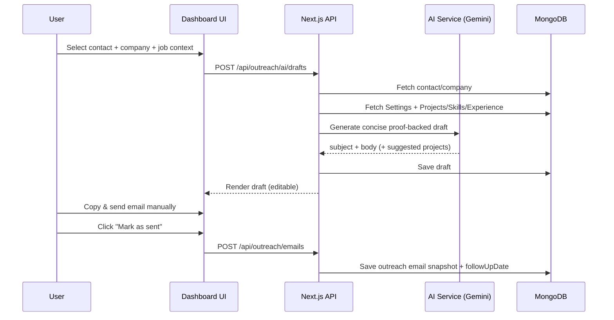
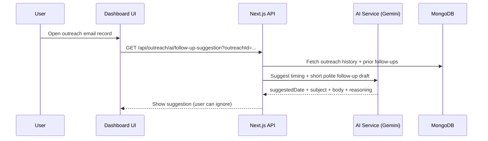
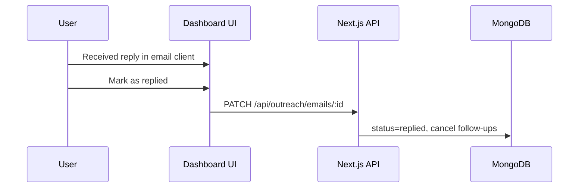

# AI Roles — Cold Outreach Tool (Aligned to This Repo)

AI is a copilot, not an actor.

Core rule:
> AI assists writing, personalization, timing suggestions, and analysis — **never execution**.

The user remains responsible for:
- sending emails (manual)
- deciding when to follow up
- marking replied/closed outcomes

---

## Where AI gets context (portfolio-aware)

AI drafting should use *your real portfolio data* as proof points:
- Settings (name, bio, links, resume URL)
- Published Projects (title, shortDescription, tech)
- Skills / Experience (high-signal bullets)

This is what makes the tool “aligned to the portfolio dashboard” instead of a generic cold-email generator.

---

## Sequence diagrams

### A) Generate draft → human sends → log it



### B) Follow-up suggestion (human decides)



### C) Manual reply logging (no inbox access)



---

## AI endpoints (proposed)

### `POST /api/outreach/ai/drafts` — generate draft

Input:
```ts
{
  contactId: string
  jobTitle: string
  jobDescription: string
  intent: "cold" | "post-application" | "follow-up"
  tone: "professional" | "friendly"
  includeProjectIds?: string[] // optional user selection
}
```

Output:
```ts
{
  draftId: string
  subject: string
  body: string
  suggestedProjectIds?: string[]
  suggestions?: string[]
}
```

### `POST /api/outreach/ai/improve` — rewrite existing text

Input:
```ts
{
  text: string
  goal: "shorten" | "clarify" | "sound-confident" | "more-friendly"
}
```

Output:
```ts
{
  improvedText: string
  explanation?: string
}
```

### `GET /api/outreach/ai/follow-up-suggestion?outreachId=...`

Output:
```ts
{
  suggestedDate: string
  suggestedSubject: string
  suggestedBody: string
  reasoning: string
}
```

---

## Interview-ready line

> “AI never sends messages in my system. It only drafts and provides decision support. Every outreach action is manually executed and logged by me.”
